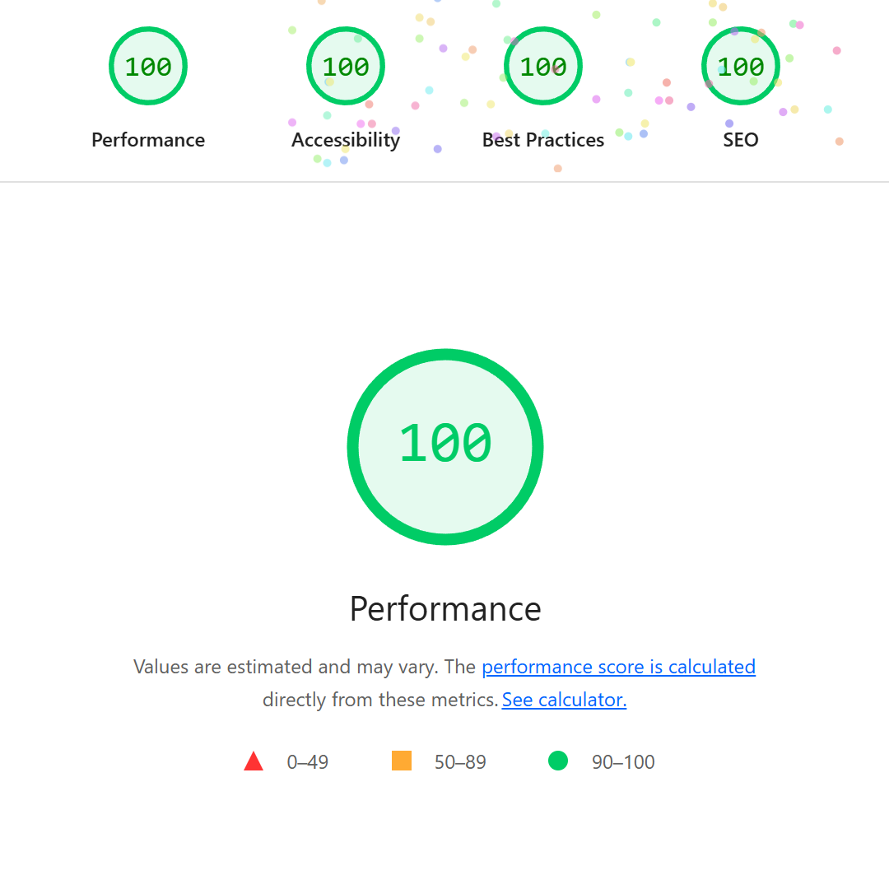

# 🐾 Patas Felizes

Projeto fictício desenvolvido como atividade acadêmica com o objetivo de praticar Bootstrap, responsividade e acessibilidade no desenvolvimento de interfaces web.

O tema escolhido foi uma landing page para o projeto Patas Felizes, uma iniciativa de adoção responsável de pets.

## Sumário

- [Tecnologias Utilizadas](#-tecnologias-utilizadas)
- [Objetivos do Projeto](#-objetivos-do-projeto)
- [Pré-requisitos](#pré-requisitos)
- [Como Executar](#como-executar)
- [Layout e Funcionalidades](#-layout-e-funcionalidades)
- [Screenshots](#️-screenshots)
- [Estrutura do Projeto](#-estrutura-do-projeto)
- [Recursos de Acessibilidade](#-recursos-de-acessibilidade)
- [Aprendizados](#-aprendizados)

## 🚀 Tecnologias Utilizadas

- HTML
- SCSS
- Bootstrap
- Ícones Lucide
- Vite (bundler)

## 🎯 Objetivos do Projeto

- Praticar o uso do Bootstrap para criar layouts responsivos.
- Aplicar conceitos de design responsivo (mobile-first).
- Garantir acessibilidade com uso de aria-labels, textos alternativos em imagens (alt) e semântica HTML.
- Criar uma experiência de navegação fluida, tanto em desktop quanto em dispositivos móveis.

## Pré-requisitos

Escolha uma das opções para executar o projeto:

- [Node.js](https://nodejs.org/en/download) (versão recomendada: 20.19+)
- [Docker](https://www.docker.com/)

## Como Executar

Você pode executar o projeto de duas formas:

1. **Com Docker** (recomendado para evitar configurações locais)
2. **Localmente com Node.js**

### Clone o Projeto

Clone este repositório em sua máquina local:

```bash
git clone https://github.com/sirkaue/patas-felizes-bootstrap.git
```

### Executar com Docker

1. Navegue até a pasta raiz do projeto:

   ```bash
   cd patas-felizes-bootstrap
   ```

2. Construa a imagem Docker:

   ```bash
   docker build -t patas-felizes-bootstrap:latest .
   ```

3. Execute o container:

   ```bash
   docker run --rm -p 8080:80 --name patas-felizes-bootstrap patas-felizes-bootstrap:latest
   ```

Após executar os comandos acima, a aplicação estará disponível em [http://localhost:8080](http://localhost:8080).

### Executar Localmente

1. Acesse a pasta do projeto:

   ```bash
   cd patas-felizes-bootstrap
   ```

2. Instale as dependências:

   ```bash
   npm install
   ```

3. Inicie o servidor de desenvolvimento:

   ```bash
   npm run dev
   ```

4. Acesse a aplicação em [http://localhost:5173](http://localhost:5173).

## 📸 Layout e Funcionalidades

- **Header fixo (sticky) com menu adaptável:**

  - Menu horizontal em telas grandes.
  - Dropdown acessível em telas menores.

- **Seção Hero** com título, descrição, botões de ação e imagem ilustrativa.

- **Benefícios da adoção** organizados em cards responsivos.

- **Histórias de Sucesso** apresentando pets já adotados, com imagens, depoimentos e informações sobre a adoção.

- **Footer informativo** com:
  - Sobre o projeto.
  - Links úteis.
  - Contatos fictícios.

## 🖼️ Screenshots

Abaixo alguns exemplos da interface da aplicação:




## 📁 Estrutura do Projeto

O projeto está organizado da seguinte forma:

```plaintext
patas-felizes-bootstrap/
├── public/
├── src/
│   ├── js/
│   │   ├── initBootstrap.js
│   │   ├── initLucide.js
│   │   ├── main.js
│   │   └── initTestimonials.js
│   ├── scss/
│   │   ├── bootstrap.scss
│   │   └── styles.scss
│   └── index.html
└── vite.config.js
```

## ♿ Recursos de Acessibilidade

- Uso de atributos alt em todas as imagens.
- Navegação acessível com aria-labels.
- Contraste adequado entre textos e fundos.
- Estrutura semântica clara com header, main, section, article, footer.

## 📚 Aprendizados

Durante a atividade, foram reforçados conceitos importantes:

- Estruturar uma página mobile-first.
- Usar componentes e utilitários do Bootstrap para responsividade.
- Criar páginas mais inclusivas com boas práticas de acessibilidade.

## 📝 Observação

Este projeto é fictício e foi desenvolvido apenas para fins educacionais.
Nenhum dos contatos, histórias ou imagens representa uma entidade real.
